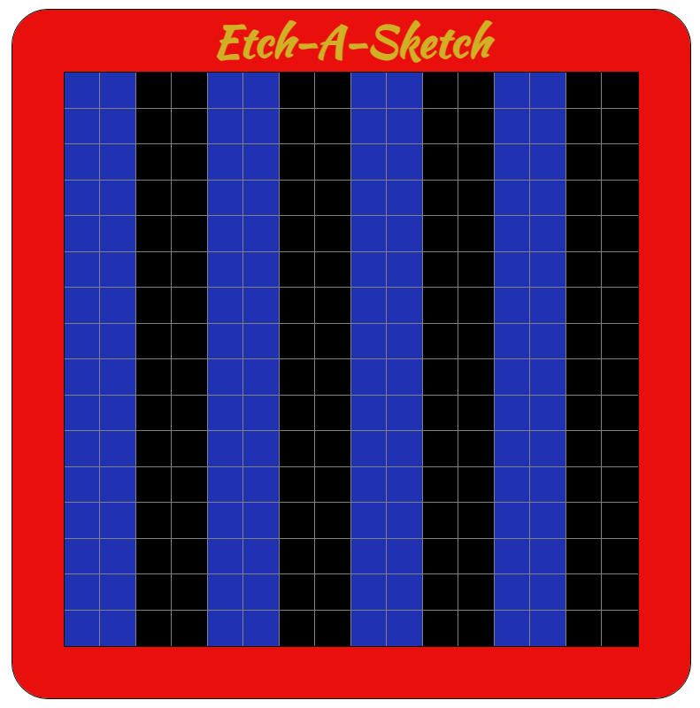

# Etch-A-Sketch
This is a project for the OdinProject web-dev course

Live example at: https://scolombo30.github.io/Etch-A-Sketch/

The main part of the project is the "drawing board" made with square divs tha change background color when the mouse hover on them.

The other important part if the control center, where you can change the grid size, the color, clear the board and reset the color

